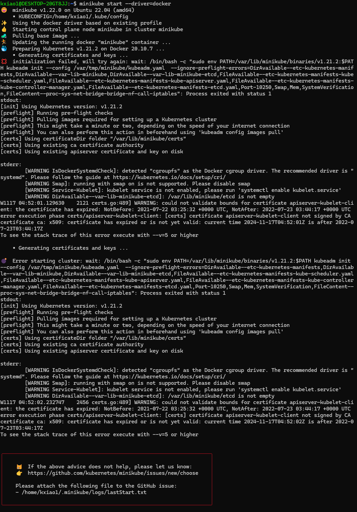
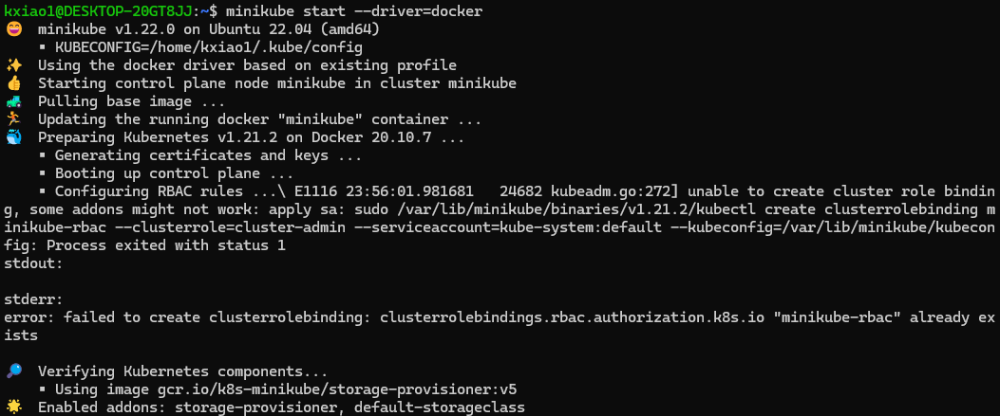
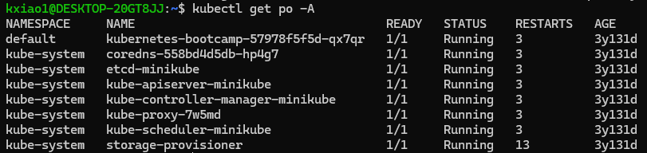
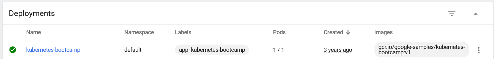
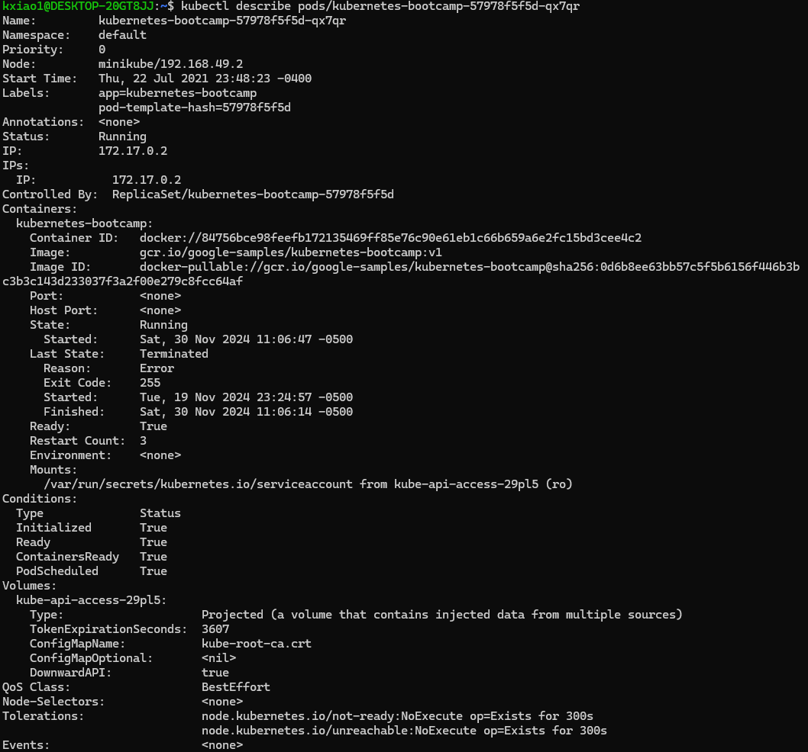

# Kubernetes tutorial, rebooted

## Installing Minikube

_Context: I had followed the same(?) [tutorial](https://kubernetes.io/docs/tutorials/hello-minikube/) in July 2021_

Brief steps for WSL2:

- Install Docker Desktop for WSL2 _(already done)_
- Install ``minikube`` in WSL2 terminal [here](https://minikube.sigs.k8s.io/docs/start/?arch=%2Flinux%2Fx86-64%2Fstable%2Fbinary+download) _(already done)_
- Start Docker Desktop, log in etc...
- Start minikube: ``minikube start --driver=docker`` ([source](https://minikube.sigs.k8s.io/docs/drivers/docker/))

At this point I ran into a certificate error



since my previous attempt in 2021 installed certificates that expired in 2022. Deleting the ``~/.minikube`` (remember, we are in Linux now) folder didn't help. Finally, with the container still running, I followed this [GitHub comment](https://github.com/kubernetes/minikube/issues/10122#issuecomment-2062101166)

```bash
minikube ssh
PATH="/var/lib/minikube/binaries/v1.21.2:$PATH"
kubeadm certs renew all --cert-dir /var/lib/minikube/certs
exit
```

This modifies ``/var/lib/minikube/certs`` _within_ the minikube container. Result after exiting and re-running ``minikube start --driver=docker``:



Curiously, this also seemed to update the ``~/.minikube`` and ``~/.kube`` folders  _outside_ the container (i.e. in WSL2). But the question remains of how the certificates are "remembered" between container boots. When they are renewed inside, they have to somehow be saved outside if we assume containers are stateless.

Alternatively, and perhaps more likely, before the certificate renewal, they are hardcoded as part of the docker image that is repreatedly executed. The update then regenerates the certificates in ``/.minikube``, and the dockerfile reads from it to generate a new image.

More details about the certificates, but not how they are generated, lie [here](https://kubernetes.io/docs/tasks/administer-cluster/kubeadm/kubeadm-certs/).

The next day, after updating Docker Desktop, thankfully it still works!


### At this point the tutorial bifurcates $\dots$

Following [minikube](https://minikube.sigs.k8s.io/docs/start/?arch=%2Flinux%2Fx86-64%2Fstable%2Fbinary+download), we will play wwith ``kubectl`` a bit:



but back to the ["main quest"](https://kubernetes.io/docs/tutorials/hello-minikube/),

```bash
# Run in a new terminal: minikube opens the webapp for you
minikube dashboard

# Run by yourself with the provided URL
minikube dashboard --url
```

At this point I noticed that my ``kubernetes-bootcamp`` deployment has been running for the past three years :joy:



``kubectl`` tells me the same...



To delete those pods and start over,

```bash
kubectl scale deployment kubernetes-bootcamp --replicas=0 # https://www.baeldung.com/ops/kubernetes-stop-pause
kubectl delete pod kubernetes-bootcamp-57978f5f5d-qx7qr

# OR
minikube delete # sledgehammer
```

The Minikube provides a deployment to play with:

```bash
kubectl create deployment hello-node --image=registry.k8s.io/e2e-test-images/agnhost:2.39 -- /agnhost netexec --http-port=8080

# ... TODO
kubectl delete deployment hello-node
```

### Other main concepts in the tutorial

Overview ([Viewing Pods and Node](https://kubernetes.io/docs/tutorials/kubernetes-basics/explore/explore-intro/))
> A __Pod__ is a group of one or more application containers (such as Docker) and includes shared storage (volumes), IP address and information about how to run them.  
A Pod always runs on a __Node__. A Node is a worker machine in Kubernetes and may be either a virtual or a physical machine, depending on the cluster. Each Node is managed by the control plane.

### Beyond the tutorial

One can extend Kubernetes by defining custom resources and custom controllers that operate on them. This is known as the [operator pattern](https://kubernetes.io/docs/concepts/extend-kubernetes/operator/) of which the [__Dask Kubernetes Operator__](#dask) is a prime example.

> Kubernetes' operator pattern concept lets you extend the cluster's behaviour without modifying the code of Kubernetes itself by linking controllers to one or more custom resources.  
Operators are clients of the Kubernetes API that act as controllers for a Custom Resource.

You first create [Custom Resource Definitions](https://kubernetes.io/docs/tasks/extend-kubernetes/custom-resources/custom-resource-definitions/), and then label templates with ``kind: CustomResourceName``. This is referenced in the [Concepts](https://kubernetes.io/docs/concepts/extend-kubernetes/api-extension/custom-resources/#customresourcedefinitions) page, but [down the same page](https://kubernetes.io/docs/concepts/extend-kubernetes/api-extension/custom-resources/#accessing-a-custom-resource) it is also curiously mentioned that

> Kubernetes client libraries can be used to access custom resources. Not all client libraries support custom resources. The Go and Python client libraries do.

Anyway, I found an [online tutorial](https://dev.to/thenjdevopsguy/creating-a-custom-resource-definition-in-kubernetes-2k7o) with a toy example of a custom resource.

See also Kubernetes' built-in controllers e.g. Deployment, StatefulSet: [Workload Management](https://kubernetes.io/docs/concepts/workloads/controllers/).

## Helm

A Helm chart resembles a Dockerfile. It uses values and templates to manage Kubernetes deployments. The outermost file ``Chart.yaml`` seems kind of useless.

According to the [Helm docs](https://helm.sh/docs/chart_template_guide/),

> Templates generate __manifest__ files, which are YAML-formatted resource descriptions that Kubernetes can understand.

This is mentioned somewhat obliquely on the [Kubernetes side](https://kubernetes.io/docs/concepts/workloads/management/) as well:

> Management of multiple resources can be simplified by grouping them together in the same file (separated by --- in YAML)...
Multiple resources can be created the same way as a single resource:  
```kubectl apply -f https://k8s.io/examples/application/nginx-app.yaml```  
... The resources will be created in the order they appear in the __manifest__.

This page shouldn't be under Workloads since it also mentions services, but Kubernetes documentation isn't super well-organized as a whole.

### Installation ([ref](https://helm.sh/docs/intro/install/#from-script))

```bash
curl -fsSL -o get_helm.sh https://raw.githubusercontent.com/helm/helm/main/scripts/get-helm-3
chmod 700 get_helm.sh
./get_helm.sh
```

### Quickstart ([ref](https://helm.sh/docs/intro/quickstart/))

Crash course with the most important commands:

```bash
helm repo add bitnami https://charts.bitnami.com/bitnami
helm search repo bitnami

helm repo update
helm install bitnami/mysql --generate-name # e.g. mysql-1733020493

helm show chart bitnami/mysql
helm show all bitnami/mysql

# my own debugging
kubectl describe pods/mysql-1733020493-0
kubectl logs pods/mysql-1733020493-0 
kubectl get pod mysql-1733020493-output=yaml > err.yaml # https://kubernetes.io/docs/tasks/debug/debug-application/determine-reason-pod-failure/
# https://github.com/docker-library/mysql/issues/1058#issuecomment-2105000516 ?
> 2024-12-01T03:48:19.687979Z 0 [Warning] [MY-010001] [Server] Can''t create thread to handle bootstrap (errno: 1)__

helm list
helm uninstall mysql-1733020493

helm get -h
```

### Actual tutorial ([ref](<https://helm.sh/docs/chart_template_guide/getting_started/>))

```bash
helm create mychart
touch mychart/templates/configmap.yaml # etc.... (follow tutorial)

# TODO
```

## Dask

I downloaded the [Helm templates](https://artifacthub.io/packages/helm/dask/dask-kubernetes-operator) referenced in [this](https://medium.com/@mucagriaktas/creating-dask-with-dask-operator-using-kubecluster-and-helm-f62a03f4814b) and [this](https://medium.com/@varunrathod0045/dask-on-kubernetes-part-1-71b452bef081) Medium tutorial.

Confusingly, there is another set of Helm Templates just called [dask](https://artifacthub.io/packages/helm/dask/dask) that I chanced upon when looking at Dask's [Github](https://github.com/dask/helm-chart?tab=readme-ov-file). For now we focus on the actual __Dask Kubernetes Operator__ and its [documentation](https://kubernetes.dask.org/en/latest/).

```bash
# I had to fix my conda (it was version 4.14...)
# https://stackoverflow.com/questions/73974735/conda-update-conda-does-not-update-conda
conda install -n base conda=24.9.2

conda install dask-kubernetes -c conda-forge

minikube start --driver=docker

helm install dask-kubernetes-operator-loc dask-kubernetes-operator/ # use templates in this repo
```

I theorize that those Docker/ Kubernetes/ Operator solutions do conceptually the same thing as the ["manual" approach](https://distributed.dask.org/en/stable/quickstart.html) with schedulers and workers on the same address:

```bash
conda install dask
conda install dask distributed -c conda-forge

# then follow the website
dask scheduler
> 127.0.0.1:8786

dask worker 127.0.0.1:8786
dask worker 127.0.0.1:8786
dask worker 127.0.0.1:8786 # as many workers as needed
```

And then in Python:

```python
from dask.distributed import Client
client = Client('127.0.0.1:8786')
```
