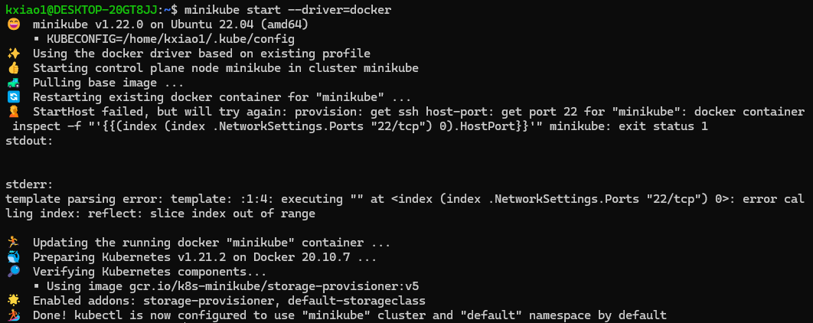
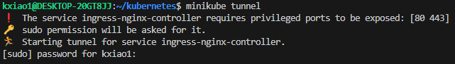
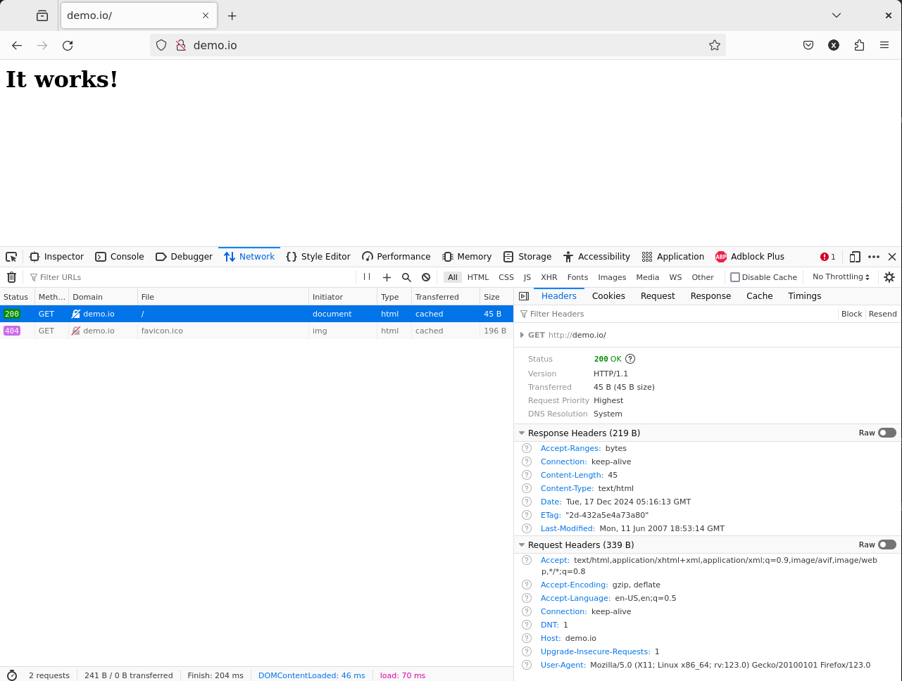

# Kubernetes tutorial, rebooted (this time with applications)

## Kubernetes

### Installing k8s with Minikube

_Context: I had followed the same(?) [tutorial](https://kubernetes.io/docs/tutorials/hello-minikube/) in July 2021_

Brief steps for WSL2:

- Install Docker Desktop for WSL2 _(already done)_
- Install ``minikube`` in WSL2 terminal from [here](https://minikube.sigs.k8s.io/docs/start/?arch=%2Flinux%2Fx86-64%2Fstable%2Fbinary+download) _(already done)_
- Start Docker Desktop in Windows and log in (if this step is skipped, the ``docker`` command will not work in WSL)
- Now go back to the WSL terminal and run all following commands in WSL
- Start minikube: ``minikube start --driver=docker`` ([source](https://minikube.sigs.k8s.io/docs/drivers/docker/))

At this point I ran into a certificate error


since my previous attempt in 2021 installed certificates that expired in 2022. Deleting the ``~/.minikube`` (remember, we are in Linux now) folder didn't help. Finally, with the container still running, I followed this [GitHub comment](https://github.com/kubernetes/minikube/issues/10122#issuecomment-2062101166)

```bash
minikube ssh
PATH="/var/lib/minikube/binaries/v1.21.2:$PATH"
kubeadm certs renew all --cert-dir /var/lib/minikube/certs
exit
```

This modifies ``/var/lib/minikube/certs`` _within_ the minikube container. Result after exiting and re-running ``minikube start --driver=docker``:


Curiously, this also seemed to update the ``~/.minikube`` and ``~/.kube`` folders  _outside_ the container (i.e. in WSL2). But the question remains of how the certificates are "remembered" between container boots. When they are renewed inside, they have to somehow be saved outside if we assume containers are stateless.

Alternatively, and perhaps more likely, before the certificate renewal, they are hardcoded as part of the docker image that is repreatedly executed. The update then regenerates the certificates in ``/.minikube``, and the dockerfile reads from it to generate a new image.

More details about the certificates, but not how they are generated, lie [here](https://kubernetes.io/docs/tasks/administer-cluster/kubeadm/kubeadm-certs/).

The next day, after updating Docker Desktop, thankfully it still works!



### At this point the tutorial bifurcates $\dots$

Following [minikube](https://minikube.sigs.k8s.io/docs/start/?arch=%2Flinux%2Fx86-64%2Fstable%2Fbinary+download), we will play wwith ``kubectl`` a bit:


but back to the ["main quest"](https://kubernetes.io/docs/tutorials/hello-minikube/),

```bash
# Run in a new terminal: minikube opens the webapp for you
minikube dashboard

# Run by yourself with the provided URL
minikube dashboard --url
```

At this point I noticed that my ``kubernetes-bootcamp`` deployment has been running for the past three years :joy:


``kubectl`` tells me the same...


To delete those pods and start over,

```bash
kubectl scale deployment kubernetes-bootcamp --replicas=0 # https://www.baeldung.com/ops/kubernetes-stop-pause
kubectl delete pod kubernetes-bootcamp-57978f5f5d-qx7qr

# OR
minikube delete # sledgehammer
```

The Minikube provides a deployment to play with:

```bash
kubectl create deployment hello-node --image=registry.k8s.io/e2e-test-images/agnhost:2.39 -- /agnhost netexec --http-port=8080

# ... TODO
kubectl delete deployment hello-node
```

### Other main concepts in the tutorial

Overview of the hierarchy ([Viewing Pods and Node](https://kubernetes.io/docs/tutorials/kubernetes-basics/explore/explore-intro/))
> A __Pod__ is a group of one or more application containers (such as Docker) and includes shared storage (volumes), IP address and information about how to run them.  
A Pod always runs on a __Node__. A Node is a worker machine in Kubernetes and may be either a virtual or a physical machine, depending on the cluster. Each Node is managed by the control plane.

\#TODO

### Real-world Kubernetes I: Services

This section and the next address the burning question: How do pods talk to one another across nodes (e.g. internal clients) and with public-IP clients?

First note that under the hood, the container's operations in its isolated world have to be _exposed_ to external prying eyes. Let's recall (or learn from [the interactive tutorial](https://github.com/docker/getting-started)) how this works in Docker:

```console
...Pull nginx and expose port 80 in the container to port 8080 on the host
$ docker run -d -p 8080:80 nginx
Unable to find image 'nginx:latest' locally
latest: Pulling from library/nginx
bc0965b23a04: Pull complete 
650ee30bbe5e: Pull complete 
8cc1569e58f5: Pull complete 
362f35df001b: Pull complete 
13e320bf29cd: Pull complete 
7b50399908e1: Pull complete 
57b64962dd94: Pull complete 
Digest: sha256:fb197595ebe76b9c0c14ab68159fd3c08bd067ec62300583543f0ebda353b5be
Status: Downloaded newer image for nginx:latest
ff01baebf9c2c802ff5b3061b18ef6284f1fb28227442394def2edc6c3dacee5

$ curl localhost:8080
<html>
<head>
<title>Welcome to nginx!</title>
<style>
html { color-scheme: light dark; }
body { width: 35em; margin: 0 auto;
font-family: Tahoma, Verdana, Arial, sans-serif; }
</style>
</head>
<body>
<h1>Welcome to nginx!</h1>
<p>If you see this page, the nginx web server is successfully installed and
working. Further configuration is required.</p>

<p>For online documentation and support please refer to
<a href="http://nginx.org/">nginx.org</a>.<br/>
Commercial support is available at
<a href="http://nginx.com/">nginx.com</a>.</p>

<p><em>Thank you for using nginx.</em></p>
</body>
</html>
```

However, we actually know which ports the container's image promises to make available, in other words the ports it passed to the ``EXPOSE`` command (here we look at the history, but we can also look at the ``Dockerfile`` if it's available):

```console
$ docker images
REPOSITORY                    TAG       IMAGE ID       CREATED       SIZE
nginx                         latest    66f8bdd3810c   2 weeks ago   192MB
gcr.io/k8s-minikube/kicbase   v0.0.25   8768eddc4356   3 years ago   1.1GB

$ docker history 66f8bdd3810c
IMAGE          CREATED       CREATED BY                                      SIZE      COMMENT
66f8bdd3810c   2 weeks ago   CMD ["nginx" "-g" "daemon off;"]                0B        buildkit.dockerfile.v0
<missing>      2 weeks ago   STOPSIGNAL SIGQUIT                              0B        buildkit.dockerfile.v0
<missing>      2 weeks ago   EXPOSE map[80/tcp:{}]                           0B        buildkit.dockerfile.v0
...etc...
```

Therefore, we can use a shortcut (``-P`` = ``--publish-all``) to expose the desired ports (but note that a random ephemeral host port is chosen):

```console
$ docker run -d -P nginx
9e998fa3b3848abc0145ee4350d59710e0b5be5fd4d9753f34185e25fac4b9e9

$ docker ps
CONTAINER ID   IMAGE     COMMAND                  CREATED          STATUS          PORTS                   NAMES
9e998fa3b384   nginx     "/docker-entrypoint.…"   12 seconds ago   Up 11 seconds   0.0.0.0:32771->80/tcp   nervous_swanson

$ curl localhost:32771
...<p><em>Thank you for using nginx.</em></p>

...Remember to clean up! (Assume this is the only running container, so use with care)
$ docker container ls -q | xargs docker container kill
5262881eead3
```

While we're sidetracked, let's also install the amazing freeware [k9s](https://github.com/derailed/k9s/releases):

```bash
# download k9s_linux_amd64.deb to ~
sudo dpkg -i ~/k9s_linux_amd64.deb
```

This saves us from remembering Kubernetes (i.e. k8s) commands when configuring real-world deployments. For now, I prefer writing commands to pasting k9s screenshots.

When the container's ports are exposed (e.g. ``containerPort: 80``), Kubernetes ensures that pods can talk to one another _within_ a cluster (this is also true across nodes but we cannot see this effect using the single node on Minikube). Each pod posseses However, that they are located by __Virtual IP__ addresses The [tutorial](https://kubernetes.io/docs/tutorials/services/connect-applications-service/)'s example should clarify:

```console
$ tail .networking/run-my-nginx.yaml
  template:
    metadata:
      labels:
        run: my-nginx
    spec:
      containers:
        - name: my-nginx
          image: nginx
          ports:
            - containerPort: 80

$ kubectl apply -f ./networking/run-my-nginx.yaml
deployment.apps/my-nginx created

$ kubectl get pods -l run=my-nginx -o wide
NAME                        READY   STATUS    RESTARTS   AGE   IP           NODE       NOMINATED NODE   READINESS GATES
my-nginx-5b56ccd65f-5jjv4   1/1     Running   0          21s   172.17.0.10   minikube   <none>           <none>
my-nginx-5b56ccd65f-h69vc   1/1     Running   0          21s   172.17.0.11   minikube   <none>           <none>

$ kubectl get pods -l run=my-nginx -o custom-columns=POD_IP:.status.podIPs
POD_IP
[map[ip:172.17.0.11]]
[map[ip:172.17.0.10]]

$ minikube ssh
$ curl 172.17.0.11
... <p><em>Thank you for using nginx.</em></p>

$ exit

...now we are outside the node, so this blocks
$ curl 172.17.0.11

```

N.B. This ``nginx`` image is probably very similar to that pulled by the earlier Docker commands ([source](https://kubernetes.io/docs/concepts/containers/images/#image-names)). Thanks to ``nginx`` for providing free images!

> If you don't specify a registry hostname, Kubernetes assumes that you mean the Docker public registry.

We can do better by adding a ``Service`` layer to abstract out the individual pods, in case some of them die and are replaced. Either ``expose`` the deployment explicitly (akin to ``docker run -P``) or deploying the ``Service`` explicitly:

```console
$ head networking/nginx-svc.yaml
apiVersion: v1
kind: Service <--
metadata:
  name: my-nginx
  labels:
    run: my-nginx
spec:
  ports:
  - port: 80
    protocol: TCP

... this is equivalent to kubectl apply -f networking/nginx-svc.yaml
$ kubectl expose deployment/my-nginx

$ kubectl get svc my-nginx
NAME       TYPE        CLUSTER-IP      EXTERNAL-IP   PORT(S)   AGE
my-nginx   ClusterIP   10.106.179.45   <none>        80/TCP    3m9s

$ kubectl describe svc my-nginx
Name:              my-nginx
Namespace:         default
Labels:            <none>
Annotations:       <none>
Selector:          run=my-nginx
Type:              ClusterIP
IP Family Policy:  SingleStack
IP Families:       IPv4
IP:                10.106.179.45
IPs:               10.106.179.45
Port:              <unset>  80/TCP
TargetPort:        80/TCP
Endpoints:         172.17.0.10:80,172.17.0.11:80
Session Affinity:  None
Events:            <none>

$ kubectl get endpointslices -l kubernetes.io/service-name=my-nginx
NAME             ADDRESSTYPE   PORTS   ENDPOINTS                 AGE
my-nginx-pjswb   IPv4          80      172.17.0.10,172.17.0.11   6m5s

```

Now we can address the service directly from within the node.

```console
$ minikube ssh
$ curl 10.106.179.45
... <p><em>Thank you for using nginx.</em></p>

$ exit
```

The translation between service and pods is performed by ``kube-proxy``. See for instance [here](https://medium.com/@amroessameldin/kube-proxy-what-is-it-and-how-it-works-6def85d9bc8f).

### Real-world Kubernetes II: Ingresses

The last piece of the puzzle is exposing our service to the outside world. We're going to give a hat tip to ``nginx`` again for providing with open-source software that not only serves as good tutorial material, but more importantly actually helps websites run.

First, a word about [controllers](https://kubernetes.io/docs/concepts/architecture/controller/):

> In Kubernetes, controllers are control loops that watch the state of your cluster, then make or request changes where needed. Each controller tries to move the current cluster state closer to the desired state.

In our context, we need something that listens for external requests and informs the cluster. What Kubernetes calls an [``Ingress``](https://kubernetes.io/docs/concepts/services-networking/ingress/) combines elements of a load balancer and reverse proxy to act as a "gateway" to the service. I added the speech marks because with the cutting-edge [``Gateway API``](https://kubernetes.io/docs/concepts/services-networking/gateway/), one must be careful to avoid name conflicts. The [Ingress docs](https://kubernetes.io/docs/concepts/services-networking/ingress/#what-is-ingress) go on to introduce more terminology:

> An __Ingress controller__ is responsible for fulfilling the __Ingress__, usually with a load balancer, though it may also configure your edge router or additional frontends to help handle the traffic.

Thus, the functionality or concept of an Ingress is provided as a controller.

The [ingress-nginx tutorial](https://kubernetes.github.io/ingress-nginx/deploy/#quick-start) recommends installing an Ingress Controller with ``Helm``, a tool I cover in the next section. The Helm command masks the actual specification, so I first tried the K8s native method. After downloading the manifest, I extracted what looked to be the relevant parts:

```console
$ tail -n 50 ./networking/ingress.yaml
        kubernetes.io/os: linux
      restartPolicy: OnFailure
      serviceAccountName: ingress-nginx-admission
---
apiVersion: networking.k8s.io/v1
kind: IngressClass
metadata:
  labels:
    app.kubernetes.io/component: controller
    app.kubernetes.io/instance: ingress-nginx
    app.kubernetes.io/name: ingress-nginx
    app.kubernetes.io/part-of: ingress-nginx
    app.kubernetes.io/version: 1.12.0-beta.0
  name: nginx
spec:
  controller: k8s.io/ingress-nginx

---
...


```

The manifest defines an ``IngressClass`` - a specific configuration for the controller - rather than the Ingress resource itself (e.g. [AWS](https://kubernetes-sigs.github.io/aws-load-balancer-controller/v2.2/guide/ingress/ingress_class/)). Further down, we will create the actual Ingress (with the line ``kind: Ingress``) itself. Now we apply the YAML file:

```console
$ kubectl apply -f networking/ingress.yaml
namespace/ingress-nginx created
serviceaccount/ingress-nginx created
serviceaccount/ingress-nginx-admission created
role.rbac.authorization.k8s.io/ingress-nginx created
role.rbac.authorization.k8s.io/ingress-nginx-admission created
clusterrole.rbac.authorization.k8s.io/ingress-nginx created
clusterrole.rbac.authorization.k8s.io/ingress-nginx-admission created
rolebinding.rbac.authorization.k8s.io/ingress-nginx created
rolebinding.rbac.authorization.k8s.io/ingress-nginx-admission created
clusterrolebinding.rbac.authorization.k8s.io/ingress-nginx created
clusterrolebinding.rbac.authorization.k8s.io/ingress-nginx-admission created
configmap/ingress-nginx-controller created
service/ingress-nginx-controller created
service/ingress-nginx-controller-admission created
deployment.apps/ingress-nginx-controller created
job.batch/ingress-nginx-admission-create created
job.batch/ingress-nginx-admission-patch created
ingressclass.networking.k8s.io/nginx created
validatingwebhookconfiguration.admissionregistration.k8s.io/ingress-nginx-admission created
```

Among other things, we see two ``Service``s and a ``Deployment`` (actually one of Kubernetes' built-in Controllers) being created. As for the rest,

- A ``Job`` is another type of controller, ``RBAC`` is "Role-based access control", and objects with "RBAC" in them together implement an [authorization system](https://kubernetes.io/docs/reference/access-authn-authz/rbac/).
- A [``ConfigMap``](https://kubernetes.io/docs/concepts/configuration/configmap/) "is an API object used to store non-confidential data in key-value pairs".
- A validating admission webhook receives and responds to admission requests. They are aptly configured by [objects](https://kubernetes.io/docs/reference/access-authn-authz/extensible-admission-controllers/#configure-admission-webhooks-on-the-fly) of ``kind: ValidatingWebhookConfiguration``.

Note that the ``ingress-nginx-controller`` is actually a ``Service`` of type ``LoadBalancer``!

```console
$ kubectl get service ingress-nginx-controller -n ingress-nginx -o yaml | tail
    protocol: TCP
    targetPort: https
  selector:
    app.kubernetes.io/component: controller
    app.kubernetes.io/instance: ingress-nginx
    app.kubernetes.io/name: ingress-nginx
  sessionAffinity: None
  type: LoadBalancer
status:
  loadBalancer: {}
```

Indeed, it would have been more accurate to say that the load-balancing aspect of an ``Ingress`` is built on top of a concrete ``LoadBalancer`` service. According to [AWS documentation](https://aws.amazon.com/blogs/opensource/network-load-balancer-nginx-ingress-controller-eks/):

> An Ingress controller does not typically eliminate the need for an external load balancer, it simply adds an additional layer of routing and control behind the load balancer.

And from a [Reddit comment](https://www.reddit.com/r/kubernetes/comments/17q03f2/comment/k88ufju/?utm_source=share&utm_medium=web3x&utm_name=web3xcss&utm_term=1&utm_content=share_button) (yes, not the best source),

> Ingress operates on layer 7 while Services work on layer 3 and 4. _[Layer 3 = IP, Layer 4 = TCP/ UDP, Layer 7 = HTTP(S)]_

Alternatively, we get slightly different output when setting these up with ``Helm`` (in particular it's easier to _uninstall_ everything using Helm):

```console
$ helm upgrade --install ingress-nginx ingress-nginx \
--repo https://kubernetes.github.io/ingress-nginx \
--namespace ingress-nginx --create-namespace

Release "ingress-nginx" does not exist. Installing it now.
NAME: ingress-nginx
LAST DEPLOYED: Sun Dec 15 11:20:05 2024
NAMESPACE: ingress-nginx
STATUS: deployed
REVISION: 1
TEST SUITE: None
NOTES:
The ingress-nginx controller has been installed.
It may take a few minutes for the load balancer IP to be available.
You can watch the status by running 'kubectl get service --namespace ingress-nginx ingress-nginx-controller --output wide --watch'

An example Ingress that makes use of the controller:
  apiVersion: networking.k8s.io/v1
  kind: Ingress
  metadata:
    name: example
    namespace: foo
  spec:
    ingressClassName: nginx
    rules:
      - host: www.example.com
        http:
          paths:
            - pathType: Prefix
              backend:
                service:
                  name: exampleService
                  port:
                    number: 80
              path: /
    # This section is only required if TLS is to be enabled for the Ingress
    tls:
      - hosts:
        - www.example.com
        secretName: example-tls

If TLS is enabled for the Ingress, a Secret containing the certificate and key must also be provided:

  apiVersion: v1
  kind: Secret
  metadata:
    name: example-tls
    namespace: foo
  data:
    tls.crt: <base64 encoded cert>
    tls.key: <base64 encoded key>
  type: kubernetes.io/tls
```

The output here doesn't list what's created, but it highlights the fact that we have created the IngressClass but not the Ingress. In fact, we have a controller pod but not the controller itself:

```console
$ kubectl get pods -n ingress-nginx
NAME                                        READY   STATUS    RESTARTS   AGE
ingress-nginx-controller-6cbbbb99d7-sj9n9   1/1     Running   0          3m59s
```

Still following the [guide](https://kubernetes.github.io/ingress-nginx/deploy/#firewall-configuration), there are a few ports that should be open on the pod. I wrote its information to a file ``nginx-pod.yaml`` and one can search for 80, 443, and 8443.

```bash
kubectl -n ingress-nginx get pod -o yaml > ./networking/nginx-pod.yaml
```

We now deploy a web server and expose it as in the previous seciton.

```console
$ kubectl create deployment demo --image=httpd --port=80
deployment.apps/demo created

$ kubectl expose deployment demo
service/demo exposed
```

At this point there are two pods and three services, with the ``demo``s living in the default namespace. (_Note to future self: I had to regenerate the output because I tried to deploy the server in the ``ingress-nginx`` namespace, leading to frustrating bugs later on..._)

```console
$ kubectl get pods --all-namespaces
NAMESPACE              NAME                                         READY   STATUS    RESTARTS   AGE
default                demo-654c477f6d-fgbhs                        1/1     Running   0          52s
ingress-nginx          ingress-nginx-controller-6488564696-z6hhz    1/1     Running   1          82m
...

# kubectl get services -n ingress-nginx
NAMESPACE              NAME                                 TYPE           CLUSTER-IP      EXTERNAL-IP   PORT(S)                      AGE
default                kubernetes                           ClusterIP      10.96.0.1       <none>        443/TCP                      157m
ingress-nginx          ingress-nginx-controller             LoadBalancer   10.98.88.100    127.0.0.1     80:32508/TCP,443:32494/TCP   83m
ingress-nginx          ingress-nginx-controller-admission   ClusterIP      10.97.140.199   <none>        443/TCP                      83m
...
```

Note however that the ``LoadBalancer``'s ``External-IP`` field says "pending". There's perhaps an air of disdain in the [documentation](https://kubernetes.github.io/ingress-nginx/deploy/#online-testing) about this:

```text
If your Kubernetes cluster is a "real" cluster that supports services of type LoadBalancer, it will have allocated an external IP address or FQDN to the ingress controller... If that field shows <pending>, this means that your Kubernetes cluster wasn't able to provision the load balancer.
```

Yes, I tried this out myself by deleting ``ingress-nginx-controller`` . Fortunately, I can copy the relevant parts in ``.networking/ingress.yaml`` and apply it again with a here string (``<<<``):

```bash
kubectl apply -f - <<< "apiVersion: v1
kind: Service
metadata:
  labels:
    app.kubernetes.io/component: controller
    app.kubernetes.io/instance: ingress-nginx
    app.kubernetes.io/name: ingress-nginx
    app.kubernetes.io/part-of: ingress-nginx
    app.kubernetes.io/version: 1.12.0-beta.0
  name: ingress-nginx-controller
  namespace: ingress-nginx
spec:
  externalTrafficPolicy: Local
  ipFamilies:
  - IPv4
  ipFamilyPolicy: SingleStack
  ports:
  - appProtocol: http
    name: http
    port: 80
    protocol: TCP
    targetPort: http
  - appProtocol: https
    name: https
    port: 443
    protocol: TCP
    targetPort: https
  selector:
    app.kubernetes.io/component: controller
    app.kubernetes.io/instance: ingress-nginx
    app.kubernetes.io/name: ingress-nginx
  type: LoadBalancer"
```

At face value, that means with ``Minikube``'s puny setup, we'll not be able to reach the server from the public network. But Minikube has [got us covered](https://minikube.sigs.k8s.io/docs/handbook/accessing/#loadbalancer-access)!



After entering the admin password, the process blocks while traffic is forwarded. However, if we send ``Ctrl-Z`` to move it to the background or start a new terminal (or use K9s :smile:), we can see the EXTERNAL-IP being filled now:

```console
$ kubectl get services -n ingress-nginx
NAME                                 TYPE           CLUSTER-IP      EXTERNAL-IP   PORT(S)                      AGE
ingress-nginx-controller             LoadBalancer   10.111.165.45   127.0.0.1     80:32421/TCP,443:31142/TCP   10h
ingress-nginx-controller-admission   ClusterIP      10.100.44.58    <none>        443/TCP                      10h
```

Finally, we create the ingress resource. The asterisk ``*`` means that all paths are directed to the same service and port (see the [man page](https://kubernetes.io/docs/reference/kubectl/generated/kubectl_create/kubectl_create_ingress/)):

```console
$ kubectl create ingress demo --class=nginx --rule="demo.io/*=demo:80" -n ingress-nginx
ingress.networking.k8s.io/demo created

$ kubectl get ingress -n ingress-nginx
NAME             CLASS   HOSTS              ADDRESS     PORTS   AGE
demo-localhost   nginx   demo.localdev.me   127.0.0.1   80      63m

$ kubectl get ingress demo-localhost -o yaml
apiVersion: networking.k8s.io/v1
kind: Ingress
metadata:
  creationTimestamp: "2024-12-15T04:57:08Z"
  generation: 1
  name: demo-localhost
  namespace: default
  resourceVersion: "39354"
  uid: 3b44a504-bf49-4501-93e0-554e5f508904
spec:
  ingressClassName: nginx
  rules:
  - host: demo.localdev.me
    http:
      paths:
      - backend:
          service:
            name: demo
            port:
              number: 80
        path: /
        pathType: Prefix
status:
  loadBalancer: {}

```

If for any reason the ingress doesn't work, the [quick and dirty solution](https://github.com/kubernetes/ingress-nginx/issues/5401#issuecomment-617006161) is to delete the configuration and move on:

```bash
kubectl delete validatingwebhookconfiguration --all -n ingress-nginx
```

We then add ``demo.io`` to ``etc/hosts`` (basically a backup DNS lookup file). So when we say we want to go to ``demo.io``, ``curl`` or a browser will instead go to ``127.0.0.1`` saying that we want ``demo.io``:

```console
$ sudo -- sh -c "echo \"127.0.0.1\tdemo.io\" >> /etc/hosts"
[sudo] password for kxiao1: 

$ tail -n 1 /etc/hosts
127.0.0.1       demo.io
```

And now...

```console
$ curl demo.io
<html><body><h1>It works!</h1></body></html>

# firefox
...
```



_Be sure to test using WSL's built-in firefox, not Windows firefox! Windows knows nothing about ``etc/hosts``._

Make no mistake, the curl output took almost 2 days to get to! Many things were tried and I _think_ [deploying the ``ingress-nginx-controller`` service in its own namespace](https://stackoverflow.com/a/63167986) was the lifesaver. In other words, follow the tutorial and don't put ``demo`` in the ``ingress-nginx`` namespace!

Using ``curl``, we can achieve the same effect of connecting to 127.0.0.1 while pretending[^1] to connect to an external website (since information about the ``Host`` goes into the request body). For [local testing](https://kubernetes.github.io/ingress-nginx/deploy/#local-testing) without external IP addresses, it is necessary to manually forward public ports to private ports:

> Port-forwarding is not for a production environment use-case. But here we use port-forwarding, to simulate a HTTP request, originating from outside the cluster, to reach the service of the ingress-nginx controller, that is exposed to receive traffic from outside the cluster.

```console
$ kubectl create ingress demo-localhost --class=nginx --rule="demo.localdev.me/*=demo:80" -n ingress-nginx
ingress.networking.k8s.io/demo-localhost created

$ kubectl port-forward --namespace=ingress-nginx service/ingress-nginx-controller 8080:80

# curl --resolve demo.localdev.me:8080:127.0.0.1 http://demo.localdev.me:8080
<html><body><h1>It works!</h1></body></html>
```

Annoyingly, the bug above only affects "online" deployments. Ugh.

[^1]: Why is the "pretending" needed? [1](https://serverfault.com/questions/942430/why-does-typing-an-ip-address-instead-of-the-corresponding-domain-name-not-show), [2](https://superuser.com/questions/1810856/can-you-go-to-a-website-by-typing-the-ip-address-into-the-address-bar), [3](https://stackoverflow.com/questions/5142030/why-does-the-resolved-ip-of-youtube-com-direct-to-google-com), [4](https://stackoverflow.com/questions/5142030/why-does-the-resolved-ip-of-youtube-com-direct-to-google-com), [5](https://superuser.com/questions/710625/how-to-know-the-ip-address-of-a-website)

### Extending Kubernetes

Wrapping up the section on Kubernetes, note that one can extend Kubernetes by defining custom resources and custom controllers that operate on them. This is known as the [operator pattern](https://kubernetes.io/docs/concepts/extend-kubernetes/operator/) of which the [__Dask Kubernetes Operator__](#dask) is a prime example.

> Kubernetes' operator pattern concept lets you extend the cluster's behaviour without modifying the code of Kubernetes itself by linking controllers to one or more custom resources.  
Operators are clients of the Kubernetes API that act as controllers for a Custom Resource.

Here's an [online tutorial](https://dev.to/thenjdevopsguy/creating-a-custom-resource-definition-in-kubernetes-2k7o) with a toy example of a custom resource.

If I understand it correctly, you first create [Custom Resource Definitions](https://kubernetes.io/docs/tasks/extend-kubernetes/custom-resources/custom-resource-definitions/), and then label templates with ``kind: CustomResourceName``. This is referenced in the [Concepts](https://kubernetes.io/docs/concepts/extend-kubernetes/api-extension/custom-resources/#customresourcedefinitions) page, but [down the same page](https://kubernetes.io/docs/concepts/extend-kubernetes/api-extension/custom-resources/#accessing-a-custom-resource) it is also curiously mentioned that

> Kubernetes client libraries can be used to access custom resources. Not all client libraries support custom resources. The Go and Python client libraries do.

Custom controllers seem to be optional, unless you want to do something additional to the resource when particular Kubernetes API's are invoked. To do that you'll need to write code with a client library, e.g. [Go](https://medium.com/@disha.20.10/building-and-extending-kubernetes-a-writing-first-custom-controller-with-go-bc57a50d61f7), hence the cryptic comment above. From the [official docs](https://kubernetes.io/docs/concepts/extend-kubernetes/operator/#deploying-operators):

> The most common way to deploy an operator is to add the Custom Resource Definition and its associated Controller to your cluster.  
__The Controller will normally run outside of the control plane__, much as you would run any containerized application.  
For example, you can run the controller in your cluster as a Deployment.

As a reminder, Kubernetes' built-in controllers include Deployment, ReplicaSet, Job, and so on. See [Workload Management](https://kubernetes.io/docs/concepts/workloads/controllers/).

## Helm

A Helm chart resembles a Dockerfile. It uses values and templates to manage Kubernetes deployments. The outermost file ``Chart.yaml`` seems kind of useless.

According to the [Helm docs](https://helm.sh/docs/chart_template_guide/),

> Templates generate __manifest__ files, which are YAML-formatted resource descriptions that Kubernetes can understand.

This is mentioned somewhat obliquely on the [Kubernetes side](https://kubernetes.io/docs/concepts/overview/working-with-objects/#describing-a-kubernetes-object) as well:
> When you use the Kubernetes API to create the object (either directly or via kubectl), that API request must include that information as JSON in the request body. Most often, you provide the information to kubectl in a file known as a manifest. By convention, manifests are YAML (you could also use JSON format). Tools such as kubectl convert the information from a manifest into JSON or another supported serialization format when making the API request over HTTP.

And [later](https://kubernetes.io/docs/concepts/workloads/management/):

> Management of multiple resources can be simplified by grouping them together in the same file (separated by --- in YAML)...

Multiple resources can be created the same way as a single resource:  
```kubectl apply -f https://k8s.io/examples/application/nginx-app.yaml```  
... The resources will be created in the order they appear in the __manifest__.

This page shouldn't be under Workloads since it also mentions services, but Kubernetes documentation isn't super well-organized as a whole.

### Installation ([ref](https://helm.sh/docs/intro/install/#from-script))

```bash
curl -fsSL -o get_helm.sh https://raw.githubusercontent.com/helm/helm/main/scripts/get-helm-3
chmod 700 get_helm.sh
./get_helm.sh
```

### Quickstart ([ref](https://helm.sh/docs/intro/quickstart/))

Crash course with the most important commands:

```bash
helm repo add bitnami https://charts.bitnami.com/bitnami
helm search repo bitnami

helm repo update
helm install bitnami/mysql --generate-name # e.g. mysql-1733020493

helm show chart bitnami/mysql
helm show all bitnami/mysql

# my own debugging
kubectl describe pods/mysql-1733020493-0
kubectl logs pods/mysql-1733020493-0 
kubectl get pod mysql-1733020493-output=yaml > err.yaml # https://kubernetes.io/docs/tasks/debug/debug-application/determine-reason-pod-failure/
# https://github.com/docker-library/mysql/issues/1058#issuecomment-2105000516 ?
> 2024-12-01T03:48:19.687979Z 0 [Warning] [MY-010001] [Server] Can''t create thread to handle bootstrap (errno: 1)__

helm list
helm uninstall mysql-1733020493

helm get -h
```

### Actual tutorial ([ref](https://helm.sh/docs/chart_template_guide/getting_started/))

```bash
helm create mychart
touch mychart/templates/configmap.yaml # etc.... (follow tutorial)

# TODO
```

## Dask

I downloaded the [Helm templates](https://artifacthub.io/packages/helm/dask/dask-kubernetes-operator) referenced in [this](https://medium.com/@mucagriaktas/creating-dask-with-dask-operator-using-kubecluster-and-helm-f62a03f4814b) and [this](https://medium.com/@varunrathod0045/dask-on-kubernetes-part-1-71b452bef081) Medium tutorial.

Confusingly, there is another set of Helm Templates just called [dask](https://artifacthub.io/packages/helm/dask/dask) that I chanced upon when looking at Dask's [Github](https://github.com/dask/helm-chart?tab=readme-ov-file). For now we focus on the actual __Dask Kubernetes Operator__ and its [documentation](https://kubernetes.dask.org/en/latest/).

```bash
# I had to fix my conda (it was version 4.14...)
# https://stackoverflow.com/questions/73974735/conda-update-conda-does-not-update-conda
conda install -n base conda=24.9.2

# This is required to define the KubeCluster object in Python. 
# Otherwise, run kubectl as we do below and connect the client manually.
conda install dask-kubernetes -c conda-forge

# Start Kubernetes and install the CRD's etc
minikube start --driver=docker
helm install dask-kubernetes-operator-loc dask-kubernetes-operator/ # use local templates in this repo

# Start a new cluster
kubectl apply -f cluster.yaml # see https://kubernetes.dask.org/en/latest/operator_resources.html#daskcluster
kubectl get svc -l dask.org/cluster-name=simple
kubectl port-forward svc/simple-scheduler 8786:8786 # port forwarding

# Talk to the dask cluster from a new terminal
conda activate # base, venv etc...
python client.py
```

``client.py`` calls ``dask.distributed`` to connect to the cluster:

```python
from dask.distributed import Client
client = Client("localhost:8786")
print(client)
```

so be sure to install ``dask.distributed`` as follows:

```bash
conda install dask distributed -c conda-forge 
```

I theorize that those Docker/ Kubernetes/ Operator solutions do conceptually the same thing as the ["manual" approach](https://distributed.dask.org/en/stable/quickstart.html) with workers registering themselves at the scheduler's address:

```bash
dask scheduler
> 127.0.0.1:8786

dask worker 127.0.0.1:8786
dask worker 127.0.0.1:8786
dask worker 127.0.0.1:8786 # as many workers as needed
```

And then in Python:

```python
from dask.distributed import Client
client = Client('127.0.0.1:8786')
```

## Cleanup

When one is done playing with Kubernetes or wants to start over anew, a combination of commands can be used to delete as many resources as possible:

```console
$ kubectl delete all --all --all-namespaces
pod "dask-kubernetes-operator-loc-c9696d67b-f8p77" deleted
pod "demo-654c477f6d-k2cz6" deleted
pod "ingress-nginx-controller-6cbbbb99d7-9hqjk" deleted
pod "coredns-558bd4d5db-p7dgc" deleted
pod "etcd-minikube" deleted
pod "kube-apiserver-minikube" deleted
pod "kube-controller-manager-minikube" deleted
pod "kube-proxy-rt7f2" deleted
pod "kube-scheduler-minikube" deleted
pod "storage-provisioner" deleted
pod "dashboard-metrics-scraper-7976b667d4-wllcq" deleted
pod "kubernetes-dashboard-6fcdf4f6d-jl9lx" deleted
service "demo" deleted
service "kubernetes" deleted
service "simple-scheduler" deleted
service "ingress-nginx-controller" deleted
service "ingress-nginx-controller-admission" deleted
service "kube-dns" deleted
service "dashboard-metrics-scraper" deleted
service "kubernetes-dashboard" deleted
daemonset.apps "kube-proxy" deleted
deployment.apps "dask-kubernetes-operator-loc" deleted
deployment.apps "demo" deleted
deployment.apps "ingress-nginx-controller" deleted
deployment.apps "coredns" deleted
deployment.apps "dashboard-metrics-scraper" deleted
deployment.apps "kubernetes-dashboard" deleted
replicaset.apps "kubernetes-dashboard-6fcdf4f6d" deleted

$ helm uninstall ingress-nginx  --namespace ingress-nginx
release "ingress-nginx" uninstalled

$ kubectl delete ingress --all -n ingress-nginx
ingress.networking.k8s.io "demo" deleted
ingress.networking.k8s.io "demo-localhost" deleted

... go down the list and delete every other object in the same way
```

Shutting down Minikube is not the solution! It seems to [persist data](https://www.reddit.com/r/kubernetes/comments/fky3i6/does_minikube_cluster_persist_across_machine/) in [volumes](https://docs.docker.com/get-started/docker-concepts/running-containers/persisting-container-data/#container-volumes):


That's why, three years later, all the clusters will be still there when I revisit the subject again!
